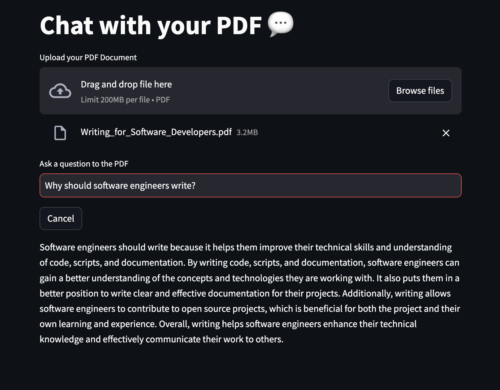

# chat-with-pdf
30 Day Gen AI - Day 1 Chat With PDF

What I learned

PyPDF seems to be more flexible than langchain's PyPDFLoader which needs to load a file path into a document

Chroma is pretty easy to use but there's a need for a collection and langchain has it's own API which I'm not sure if that's good or not

CharacterTextSplitter seems to work well on both text and langchain.Documents

What I'd like to know more

- How to best use RAG vectorstore
  - How to manage this with a REST API or websockets x

